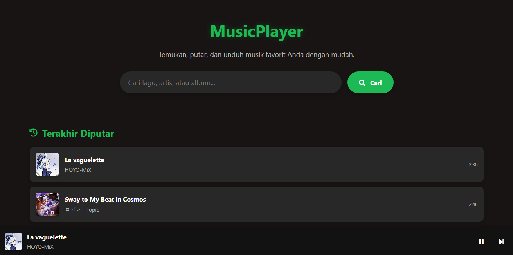

# 🎵 Music Player Web Application

<p align="center">
  
</p>

## ✨ Overview

Music Player adalah aplikasi web interaktif yang memungkinkan pengguna mencari, memutar, dan mengunduh musik dari YouTube dengan antarmuka yang responsif dan fitur intuitif.

## 🚀 Fitur Terbaru

- **Navigasi yang Ditingkatkan** - Memudahkan akses ke berbagai fitur aplikasi.
- **Optimasi Script** - Peningkatan efisiensi dan performa pemrosesan data.
- **Penambahan Footer** - Informasi penting dan atribusi dengan desain yang lebih profesional.

## ✨ Features

- **Pencarian Lagu** - Cari lagu, artis, atau album dari YouTube.
- **Pemutaran Langsung** - Putar musik langsung di browser tanpa perlu mengunduh terlebih dahulu.
- **Download MP3** - Unduh lagu yang sedang diputar dalam format MP3.
- **Riwayat Pemutaran** - Lihat dan akses kembali lagu-lagu yang baru saja diputar.
- **Antrian Lagu** - Lihat lagu berikutnya yang akan diputar dalam playlist.
- **Kontrol Pemutaran Lengkap**:
  - Play/Pause
  - Lompat ke lagu sebelumnya/berikutnya
  - Mode shuffle untuk pemutaran acak
  - Mode repeat untuk mengulang lagu saat ini
  - Kontrol timeline (lompat ke bagian tertentu dari lagu)
- **Responsive Design** - Tampilan yang optimal di desktop dan perangkat mobile.
- **Mini Player & Full Screen Mode** - Pilihan tampilan pemutaran yang fleksibel.

## 📌 Teknologi yang Digunakan

- **HTML5, CSS3, JavaScript** - Struktur dasar aplikasi.
- **Font Awesome** - Ikon UI untuk pengalaman pengguna lebih baik.
- **Siputz API** - API pencarian dan konversi YouTube ke MP3.

## 📁 Struktur Project

```
music-player/
│
├── css/
│   ├── ss.jpg                  # gambar preview
│   └── style.css               # Stylesheet utama
├── js/
│   ├── config.js               # Konfigurasi API dan pengaturan
│   └── script.js               # File JavaScript utama
├── LICENSE                     # Dokumentasi Project
├── index.html                  # File HTML utama
└── README.md                   # Dokumentasi project
```

## ⚡ Instalasi

1. Clone repository:
   ```bash
   git clone https://github.com/akaanakbaik/music-player.git
   ```
2. Buka folder proyek:
   ```bash
   cd music-player
   ```
3. Jalankan aplikasi melalui `index.html` di browser Anda.

## 🧰 Konfigurasi API

```javascript
// API URLs - Basic configuration
const API_URL = {
    SEARCH: 'https://api.siputzx.my.id/api/s/youtube',
    DOWNLOAD_MP3: 'https://api.siputzx.my.id/api/d/ytmp3'
};

// App defaults
const APP_DEFAULTS = {
    DEFAULT_SEARCH: 'popular songs 2025',
    MAX_RECENT_ITEMS: 10,
    MAX_QUEUE_ITEMS: 5,
    STORAGE_KEY: 'recentlyPlayed'
};
```

## 🔍 Penanganan Error

```javascript
try {
    // Fetch data from the API
    const response = await fetch(`${API_URL.SEARCH}?query=${encodeURIComponent(query)}`);
    const data = await response.json();
    
    // Check if we have valid results
    if (!data.status || !data.data || data.data.length === 0) {
        noResultsElement.style.display = 'block';
        return;
    }
    
    // Proceed with valid data...
} catch (error) {
    console.error('Error fetching search results:', error);
    loadingElement.style.display = 'none';
    noResultsElement.style.display = 'block';
}
```

## 🙌 Kredit & Atribusi

- **Pengembang Utama**: FlowFalcon
- **api web**: Siputzx
- **Kontributor**: Aka

---

Made with ❤️ and code by FlowFalcon  
Modification by Aka  

📩 **Kontak**  
- Email: [furinabyaka@gmail.com](mailto:furinabyaka@gmail.com)  
- GitHub: [@akaanakbaik](https://github.com/akaanakbaik)  
- WhatsApp: [+6281266950382](https://wa.me/6281266950382)
